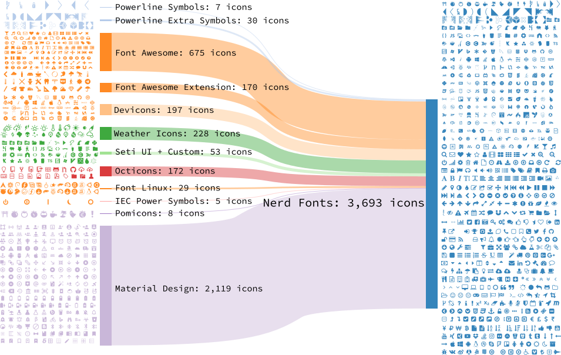

# Awesome-FOSS

- [Awesome Font](#awesome-font)

    - [Fira Code](#fira-code)
    - [Source Code Pro](#source-code-pro)
    - [Font Awesome](#font-awesome)
    - [Octicons](#octicons)
    - [Nerd Fonts](#nerd-fonts)
    - [Cascadia Code](#cascadia-code)

## Awesome Font

### [Fira Code](https://github.com/tonsky/FiraCode)

Free monospaced font with programming ligatures

### [Source Code Pro](https://github.com/adobe-fonts/source-code-pro)

Monospaced font family for user interface and coding environments

### [Font Awesome](https://github.com/FortAwesome/Font-Awesome)

The iconic SVG, font, and CSS toolkit

### [Octicons](https://github.com/primer/octicons)

Octicons are a set of SVG icons built by GitHub for GitHub.
### [Nerd Fonts](https://github.com/ryanoasis/nerd-fonts)

Nerd Fonts is a project that patches developer targeted fonts with a high number of glyphs (icons). Specifically to add a high number of extra glyphs from popular 'iconic fonts' such as [Font Awesome](https://github.com/FortAwesome/Font-Awesome), [Devicons](https://vorillaz.github.io/devicons/), [Octicons](https://github.com/primer/octicons), and others.

The following Sankey flow diagram shows the current glyph sets included:

### [Cascadia Code](https://github.com/microsoft/cascadia-code)

Cascadia is a fun new coding font that comes bundled with Windows Terminal, and is now the default font in Visual Studio as well.

